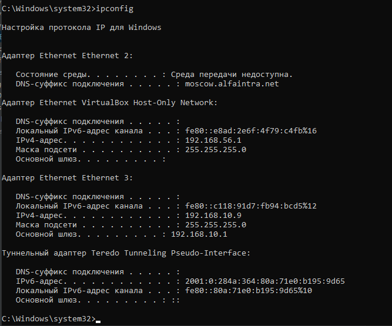
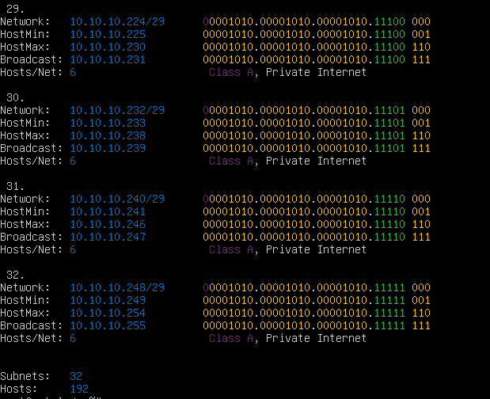

# 3.6 Компьютерные сети, лекция 1

**Вопрос** №1: Проверьте список доступных сетевых интерфейсов на вашем компьютере. Какие команды есть для этого в Linux и в Windows?

**Ответ**: Linux команда ip -c -br link

Windows ipconfig 

**Вопрос** №2: Какой протокол используется для распознавания соседа по сетевому интерфейсу? Какой пакет и команды есть в Linux для этого?

**Ответ**: Протокол LLDP, Пакет `apt lldpd`, команда lldpd. Команда `lldpctl`

**Вопрос** №3: Какая технология используется для разделения L2 коммутатора на несколько виртуальных сетей? Какой пакет и команды есть в Linux для этого? Приведите пример конфига.

**Ответ**: Технология VLAN виртуальный сетей, Пакет `apt VLAN`. команда `vconfig add` и `ip link add` и изменением файла /etc/network/interfaces

auto eth0.100

iface eth0.100 inet static

address 192.168.1.100

netmask 255.255.255.0

vlan-raw-device eth0

**Вопрос** №4: Какие типы агрегации интерфейсов есть в Linux? Какие опции есть для балансировки нагрузки? Приведите пример конфига.

**Ответ**: Типы агрегации бывают статические и динамические. AG в Linux – бондинг, имя интерфейса bond0, bond1.

**Вопрос** №5: Сколько IP адресов в сети с маской /29 ? Сколько /29 подсетей можно получить из сети с маской /24. Приведите несколько примеров /29 подсетей внутри сети 10.10.10.0/24.

**Ответ**: В /29 маске - 8 IP адресов. Из подсети 192.168.1.1/24 вышло 32 подсети /29. 

**Вопрос** №6:Задача: вас попросили организовать стык между 2-мя организациями. Диапазоны 10.0.0.0/8, 172.16.0.0/12, 192.168.0.0/16 уже заняты. Из какой подсети допустимо взять частные IP адреса? Маску выберите из расчета максимум 40-50 хостов внутри подсети.

**Ответ**: Можно испрользовать только IP адреса 100.64.0.0 — 100.127.255.255 подсеть/10. Маска с IP адресами на 40-50 хостов подсеть /26. Например: 100.64.0.0/24.

**Вопрос** №7: Как проверить ARP таблицу в Linux, Windows? Как очистить ARP кеш полностью? Как из ARP таблицы удалить только один нужный IP? 

**Ответ**: 

Linux

Команда `ip neig `

Очистка ARP полностью  `ip neigh flush`

Удаление только одно команда `ip neig del 192.168.1.1`

Windows 

команда `arp -a `

Очистка ARP полностью  `arp -d *`_

Удаление только одно команда `arp -d 192.168.1.1`

