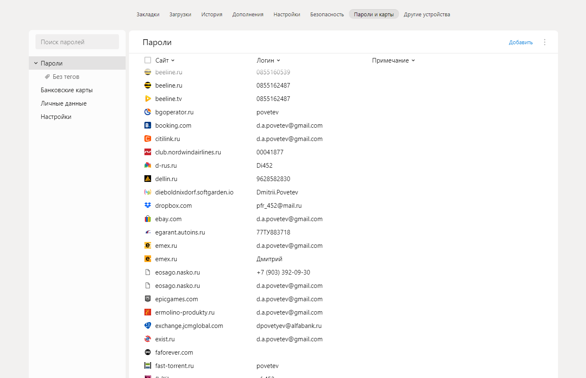
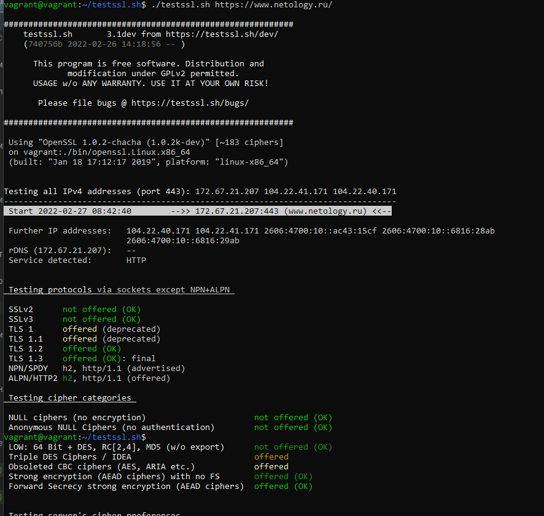
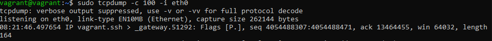
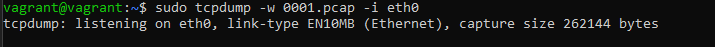

# 3.9. Элементы безопасности информационных систем

**Вопрос** №1: Установите Bitwarden плагин для браузера. Зарегестрируйтесь и сохраните несколько паролей.

**Ответ**: Пользуюсь плагином от Яндекса



**Вопрос** №2: Установите Google authenticator на мобильный телефон. Настройте вход в Bitwarden акаунт через Google authenticator OTP.

**Ответ**: Установлен, пользуюсь давно. 

**Вопрос** №3: Установите apache2, сгенерируйте самоподписанный сертификат, настройте тестовый сайт для работы по HTTPS.

**Ответ**:  Аpache2 установил, сгенерировал. Настроил. Фото приложить!!!! 

**Вопрос** №4: Проверьте на TLS уязвимости произвольный сайт в интернете (кроме сайтов МВД, ФСБ, МинОбр, НацБанк, РосКосмос, РосАтом, РосНАНО и любых госкомпаний, объектов КИИ, ВПК ... и тому подобное).

**Ответ**:  Запущена проверка на сервер www.netology.ru 



**Вопрос** №5: Установите на Ubuntu ssh сервер, сгенерируйте новый приватный ключ. Скопируйте свой публичный ключ на другой сервер. Подключитесь к серверу по SSH-ключу.

**Ответ**: 
```
di452@netology:~$ ssh-keygen
Generating public/private rsa key pair.
Enter file in which to save the key (/home/di452/.ssh/id_rsa):
Created directory '/home/di452/.ssh'.
Enter passphrase (empty for no passphrase):
Enter same passphrase again:
Your identification has been saved in /home/di452/.ssh/id_rsa
Your public key has been saved in /home/di452/.ssh/id_rsa.pub
The key fingerprint is:
SHA256:Cc3AYRAXnY9273OK7ySK+bN08pyu7icV6LCXhmbk2xU di452@netology
The key's randomart image is:
+---[RSA 3072]----+
|    o+*+ .       |
|     o.+o        |
|      . o+       |
|      o.+.E      |
|     o *So +     |
|      * = o .    |
|     o =ooo..    |
|      .++*.=o .  |
|      o+BB*o++   |
+----[SHA256]-----+
di452@netology:~$ ssh-copy-id di452@192.168.1.60
/usr/bin/ssh-copy-id: INFO: Source of key(s) to be installed: "/home/di452/.ssh/id_rsa.pub"
The authenticity of host '192.168.1.60 (192.168.1.60)' can't be established.
ECDSA key fingerprint is SHA256:4algMGB1pzwdUdHCNHZgrqhtNdwoGo8PmSDpZY5sCdk.
Are you sure you want to continue connecting (yes/no/[fingerprint])? yes
/usr/bin/ssh-copy-id: INFO: attempting to log in with the new key(s), to filter out any that are already installed /usr/bin/ssh-copy-id: INFO: 1 key(s) remain to be installed -- if you are prompted now it is to install the new keys
di452@192.168.1.60's password:

Number of key(s) added: 1

Now try logging into the machine, with:   "ssh 'di452@192.168.1.60'"
and check to make sure that only the key(s) you wanted were added.

di452@netology:~$ ssh 192.168.1.60
Enter passphrase for key '/home/di452/.ssh/id_rsa':
Welcome to Ubuntu 20.04.3 LTS (GNU/Linux 5.11.0-40-generic x86_64)

 * Documentation:  https://help.ubuntu.com
 * Management:     https://landscape.canonical.com
 * Support:        https://ubuntu.com/advantage

39 updates can be applied immediately.
22 of these updates are standard security updates.
Чтобы просмотреть дополнительные обновления выполните: apt list --upgradable

Your Hardware Enablement Stack (HWE) is supported until April 2025.
```
**Вопрос** №6: Переименуйте файлы ключей из задания 5. Настройте файл конфигурации SSH клиента, так чтобы вход на удаленный сервер осуществлялся по имени сервера.

**Ответ**: 
```
di452@netology:~/.ssh$ ls
id_rsa  id_rsa.pub  known_hosts
di452@netology:~/.ssh$ mv id_rsa secret
di452@netology:~/.ssh$ ls
id_rsa.pub  known_hosts  secret
di452@netology:~/.ssh$ mv id_rsa.pub public.pub
di452@netology:~/.ssh$ ls
known_hosts  public.pub  secret
di452@netology:~/.ssh$
```
```
Файл config
Host dapov
        HostName 192.168.1.60
        IdentityFile ~/.ssh/public.pub
        User di452
        Port 22
```
```
di452@netology:~/.ssh$ ssh dapov
Load key "/home/di452/.ssh/public.pub": invalid format
di452@192.168.1.60's password:
Welcome to Ubuntu 20.04.3 LTS (GNU/Linux 5.11.0-40-generic x86_64)

 * Documentation:  https://help.ubuntu.com
 * Management:     https://landscape.canonical.com
 * Support:        https://ubuntu.com/advantage

39 updates can be applied immediately.
22 of these updates are standard security updates.
Чтобы просмотреть дополнительные обновления выполните: apt list --upgradable

Your Hardware Enablement Stack (HWE) is supported until April 2025.
Last login: Fri Apr 8 23:55:23 2022 from 192.168.1.69
di452@dapov:~$
```
**Вопрос** №7: Соберите дамп трафика утилитой tcpdump в формате pcap, 100 пакетов. Откройте файл pcap в Wireshark.





Задание для самостоятельной отработки (необязательно к выполнению)

8*. Просканируйте хост scanme.nmap.org. Какие сервисы запущены?

9*. Установите и настройте фаервол ufw на web-сервер из задания 3. Откройте доступ снаружи только к портам 22,80,443