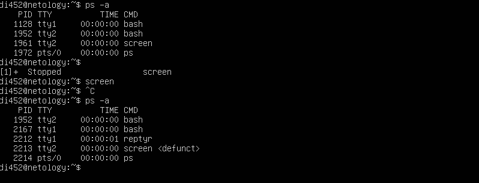
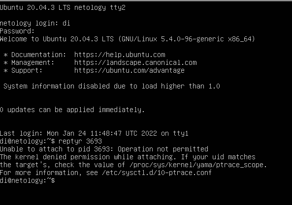

# 3.1. Доработка вопрос №13
/proc/sys/kernel/yama/ptrace_scope поменял 1 на 0. Все заработало.

# 3.1. Работа в терминале, лекция 2
**Вопрос** №1: Какого типа команда cd? Попробуйте объяснить, почему она именно такого типа; опишите ход своих мыслей, если считаете что она могла бы быть другого типа. 

**Ответ**: Это встроенная команда в Ubuntu, встроенная она потому что, работает внутри сессии терминала. Менять указатель на текущую директорию внутренней функцией быстрее и удобнее чем использовать внешний вызов. Если команда `CD` будет как внешний вызов то менять текущий каталог она будет только внутри своего окружения, а на вызвовший shell влиять не будет.

Теоретически можно сделать `CD` внешней программой, но после смены директории необходимо вызвать bash из этого (нового каталога), но тогда мы получим новый shell.
И выходя из сессии придется выходить, опять же, из всех сессий, которые создали при каждом вызове внешней CD.

**Вопрос** №2: Какая альтернатива без pipe команде `grep <some_string> <some_file> | wc -l` ?

**Ответ**: Альтернативная команда будет `grep <some_string> <some_file> -c`

**Вопрос** №3: Какой процесс с PID 1 является родителем для всех процессов в вашей виртуальной машине Ubuntu 20.04?

**Ответ**: Вводим команду pstree -p

systemd(1)──VBoxService(837)──{VBoxService}(838)─{VBoxService}(839)─{VBoxService}(840) 

**Вопрос** №4: Как будет выглядеть команда, которая перенаправит вывод stderr ls на другую сессию терминала?

**Ответ**: Открываем второй терминал. Вводим команду ls -l>/dev/pts/1.

**Вопрос** №5: Получится ли одновременно передать команде файл на stdin и вывести ее stdout в другой файл? Приведите работающий пример.

**Ответ**: Да, получится. 

Пример: 
vagrant@vagrant:~/tmp$ touch 1.txt - создаем файл 

vagrant@vagrant:~/tmp$ touch 2.txt - создаем файл вывода

vagrant@vagrant:~/tmp$ vi 1.txt - вносим данные в файл

vagrant@vagrant:~/tmp$ cat <1.txt >2.txt - настраиваем вывод

vagrant@vagrant:~/tmp$ cat 1.txt 

test123

test123

test

vagrant@vagrant:~/tmp$ cat 2.txt

test123

test123

test  

**Вопрос** №6: Получится ли находясь в графическом режиме, вывести данные из PTY в какой-либо из эмуляторов TTY? Сможете ли вы наблюдать выводимые данные?

**Ответ**: Да, перенаправление вывода. 

echo test pts1 to tty1 >/dev/tty1

**Вопрос** №7: Выполните команду bash 5>&1. К чему она приведет? Что будет, если вы выполните echo netology > /proc/$$/fd/5? Почему так происходит?

**Ответ**: Команда `bash 5>&1` создаст новый дескриптор 5 и перенаправит его в stdout

Команда `echo netology > /proc/$$/fd/5` выведет netology из 5 дескритора который мы ранее переведи в stdout.

Проиходит потому что мы перевели вывод 5>&1 в stdout.

**Вопрос** №8: Получится ли в качестве входного потока для pipe использовать только stderr команды, не потеряв при этом отображение stdout на pty?

**Ответ**: Да, получится

@vagrant:~$ ls -l /root 5>&2 2>&1 1>&5 |grep denied -c

1

5>&2 - новый дескриптор (5) перенаправили в stderr

2>&1 - stderr перенаправили в stdout 

1>&5 - stdout - перенаправили в новый дескриптор

**Вопрос** №9: Что выведет команда cat /proc/$$/environ? Как еще можно получить аналогичный по содержанию вывод?

**Ответ**: Будут выведены переменные окружения. Тоже самое можно вывести командами `printenv`, `env`

**Вопрос** №10: Используя man, опишите что доступно по адресам /proc/<PID>/cmdline, /proc/<PID>/exe

**Ответ**: 
/proc/<PID>/cmdline - полный путь до исполняемого файла процесса [PID]  (строка 231)

/proc/<PID>/exe - содержит ссылку до файла запущенного для процесса [PID], запуск этого файла, запустит еще одну копию самого файла (строка 285)

**Вопрос** №11: Узнайте, какую наиболее старшую версию набора инструкций SSE поддерживает ваш процессор с помощью /proc/cpuinfo

**Ответ**:SSE 4.2 Команда `grep sse /proc/cpuinfo`

**Вопрос** №12: При открытии нового окна терминала и vagrant ssh создается новая сессия и выделяется pty. Это можно подтвердить командой tty, которая упоминалась в лекции 3.2. Однако:

vagrant@netology1:~$ ssh localhost 'tty'

not a tty

Почитайте, почему так происходит, и как изменить поведение.

**Ответ**: Как я понял, пишет "not a tty" т.к. нет локального хоста, только эмуляция pty. Лечится добавлением "-t" принудительно создает pty

vagrant@vagrant:~$ ssh -t localhost 'tty'

vagrant@localhost's password:

/dev/pts/2

Connection to localhost closed.

**Вопрос** №13: Бывает, что есть необходимость переместить запущенный процесс из одной сессии в другую. Попробуйте сделать это, воспользовавшись reptyr. Например, так можно перенести в screen процесс, который вы запустили по ошибке в обычной SSH-сессии.

**Ответ**: Не получилось сделать в vagrand в нем нет reptyr, установить не удалось. Поставил отдельно Ubuntu при вводе команды выходит вот эта ошибка, что нужно сделать?

**Вопрос** №14: sudo echo string > /root/new_file не даст выполнить перенаправление под обычным пользователем, так как перенаправлением занимается процесс shell'а, который запущен без sudo под вашим пользователем. Для решения данной проблемы можно использовать конструкцию echo string | sudo tee /root/new_file. Узнайте что делает команда tee и почему в отличие от sudo echo команда с sudo tee будет работать.

**Ответ**: Команда tee делает вывод одновременно и в файл, указаный в качестве параметра, и в stdout, 
в данном примере команда получает вывод из stdin, перенаправленный через pipe от stdout команды echo
и так как команда запущена от sudo , соотвественно имеет права на запись в файл