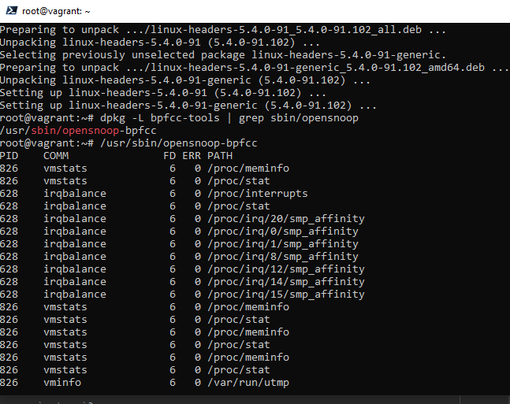

# Доработка задание №3 лекции 3.3. Операционные системы лекция 1

Обнуляем файл echo '' >/proc/21252/fd/3

# 3.3. Операционные системы лекция 1

**Вопрос** №1: Какой системный вызов делает команда cd? В прошлом ДЗ мы выяснили, что cd не является самостоятельной программой, это shell builtin, поэтому запустить strace непосредственно на cd не получится. Тем не менее, вы можете запустить strace на /bin/bash -c 'cd /tmp'. В этом случае вы увидите полный список системных вызовов, которые делает сам bash при старте. Вам нужно найти тот единственный, который относится именно к cd. Обратите внимание, что strace выдаёт результат своей работы в поток stderr, а не в stdout.

**Ответ**: Я так понял что это строчка `chdir("/tmp")`

**Вопрос** №2: Попробуйте использовать команду file на объекты разных типов на файловой системе. Например:
vagrant@netology1:~$ file /dev/tty

/dev/tty: character special (5/0)

vagrant@netology1:~$ file /dev/sda

/dev/sda: block special (8/0)

vagrant@netology1:~$ file /bin/bash

/bin/bash: ELF 64-bit LSB shared object, x86-64

Используя strace выясните, где находится база данных file на основании которой она делает свои догадки.

**Ответ**: Файл базы данных `file` находится /usr/share/misc/magic.mgc

stat("/home/vagrant/.magic.mgc", 0x7ffdb2297350) = -1 ENOENT (No such file or directory)

stat("/home/vagrant/.magic", 0x7ffdb2297350) = -1 ENOENT (No such file or directory)

openat(AT_FDCWD, "/etc/magic.mgc", O_RDONLY) = -1 ENOENT (No such file or directory)

stat("/etc/magic", {st_mode=S_IFREG|0644, st_size=111, ...}) = 0

openat(AT_FDCWD, "/etc/magic", O_RDONLY) = 3

**Вопрос** №3: Предположим, приложение пишет лог в текстовый файл. Этот файл оказался удален (deleted в lsof), однако возможности сигналом сказать приложению переоткрыть файлы или просто перезапустить приложение – нет. Так как приложение продолжает писать в удаленный файл, место на диске постепенно заканчивается. Основываясь на знаниях о перенаправлении потоков предложите способ обнуления открытого удаленного файла (чтобы освободить место на файловой системе).

**Ответ**:
Делал с редактором Vi:

Открыл новый терминал в нем создал файл tst_bash в VI, сохранил, но не закрывал. Удалил файл, а потом восстановил. 

**Вопрос** №4: Занимают ли зомби-процессы какие-то ресурсы в ОС (CPU, RAM, IO)?

**Ответ**: Нет, зомби-процессы не занимают ресурсы ОС, но они занимают и не освобождают запись в таблице процессов. Запись освободиться только при вызове wait() родительским процессом. 

**Вопрос** №5: В iovisor BCC есть утилита opensnoop:
root@vagrant:~# dpkg -L bpfcc-tools | grep sbin/opensnoop
/usr/sbin/opensnoop-bpfcc
На какие файлы вы увидели вызовы группы open за первую секунду работы утилиты? Воспользуйтесь пакетом bpfcc-tools для Ubuntu 20.04. Дополнительные сведения по установке.

**Ответ**: 

**Вопрос** №6: Какой системный вызов использует uname -a? Приведите цитату из man по этому системному вызову, где описывается альтернативное местоположение в /proc, где можно узнать версию ядра и релиз ОС.

**Ответ**: 

системный вызов uname()

     Part of the utsname information is also accessible  via  /proc/sys/kernel/{ostype, hostname, osrelease, version, domainname}.

**Вопрос** №7: Чем отличается последовательность команд через ; и через && в bash? Например:

root@netology1:~# test -d /tmp/some_dir; echo Hi

Hi

root@netology1:~# test -d /tmp/some_dir && echo Hi

root@netology1:~#

Есть ли смысл использовать в bash &&, если применить `set -e`?

**Ответ**: 

`;` - разделитель последовательных команд, `&&`- условный оператор, echo выполниться только при успешном завершении `test` 

`set -e` - прерывает сессию при любом ненулевом значении исполняемых команд в конвеере кроме последней.

При использовании `&&` вместе с `set -e`- нет смысла, так как при ошибке выполнение команд прекратиться. 

**Вопрос** №8: Из каких опций состоит режим bash set -euxo pipefail и почему его хорошо было бы использовать в сценариях?

**Ответ**: 

-e прерывает выполнение исполнения при ошибке любой команды кроме последней в последовательности 

-x вывод трейса простых команд 

-u неустановленные/не заданные параметры и переменные считаются как ошибки, с выводом в stderr текста ошибки и выполнит завершение неинтерактивного вызова

-o pipefail возвращает код возврата набора/последовательности команд, ненулевой при последней команды или 0 для успешного выполнения команд.

Это команда `-o pipefail` помогает понять завершился сценарий с ошибкой или выполнился.

**Вопрос** №9: Используя -o stat для ps, определите, какой наиболее часто встречающийся статус у процессов в системе. В man ps ознакомьтесь (/PROCESS STATE CODES) что значат дополнительные к основной заглавной буквы статуса процессов. Его можно не учитывать при расчете (считать S, Ss или Ssl равнозначными).

**Ответ**: 

Не могу запустить команду `ps stat -o` пишет нет error: TTY could not be found. Попробую развернуть вирт. машину с tty.

S*(S,S+,Ss,Ssl,Ss+) - Процессы ожидающие завершения (спящие с прерыванием "сна")

I*(I,I<) - фоновые(бездействующие) процессы ядра

( <,+... ) - это доп характеристики, например приоритет.