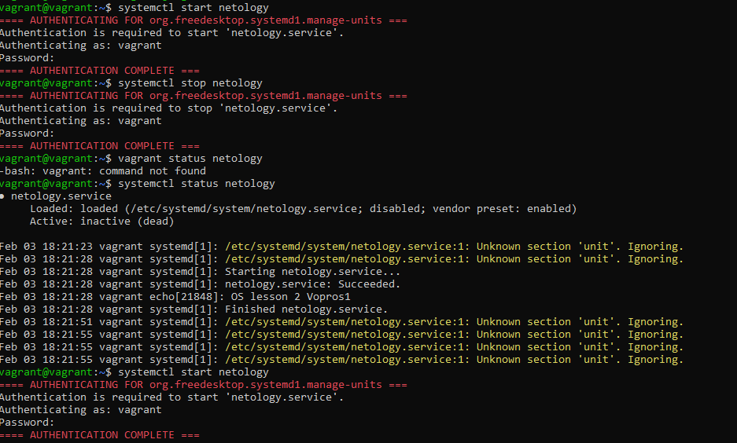
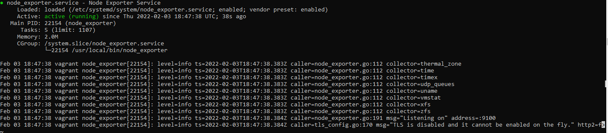
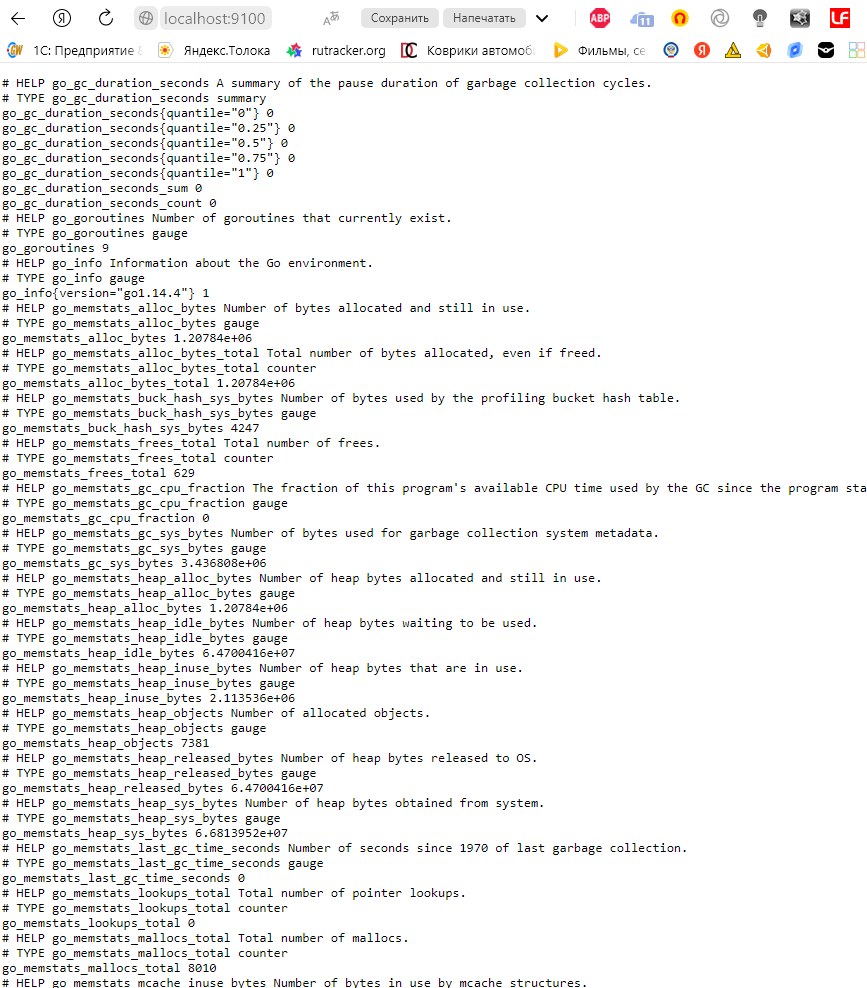
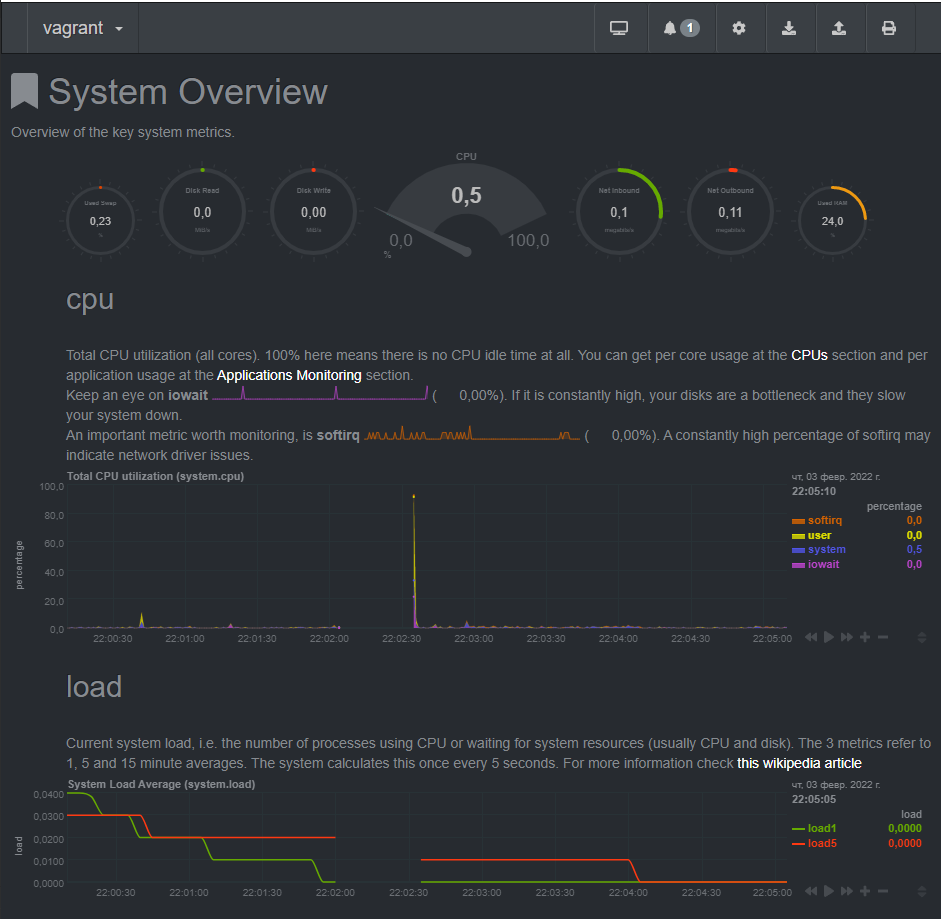
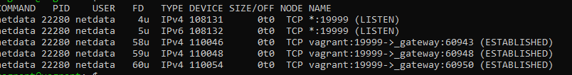
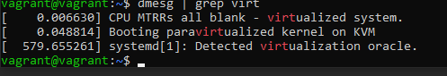
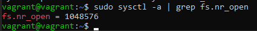
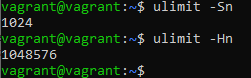
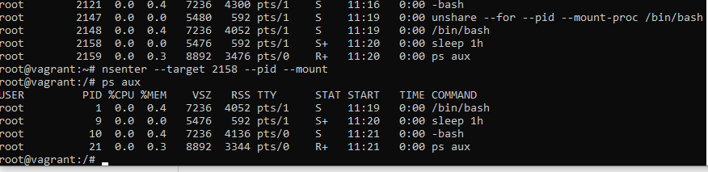

# 3.3. Операционные системы лекция 2

**Вопрос** №1: На лекции мы познакомились с node_exporter. В демонстрации его исполняемый файл запускался в background. Этого достаточно для демо, но не для настоящей production-системы, где процессы должны находиться под внешним управлением. Используя знания из лекции по systemd, создайте самостоятельно простой unit-файл для node_exporter:

поместите его в автозагрузку,

предусмотрите возможность добавления опций к запускаемому процессу через внешний файл (посмотрите, например, на systemctl cat cron),

удостоверьтесь, что с помощью systemctl процесс корректно стартует, завершается, а после перезагрузки автоматически поднимается.

**Ответ**: 
Создал Unit файл в /etc/systemd/system/netology.service. Запустил, проверил работы, остановил.

**Вопрос** №2: Ознакомьтесь с опциями node_exporter и выводом /metrics по-умолчанию. Приведите несколько опций, которые вы бы выбрали для базового мониторинга хоста по CPU, памяти, диску и сети.

**Ответ**: запустил node_exporter и выводом /metrics.

пробросил порт 9100 в vagrant открыл на локальной машине.

CPU:
    

    node_cpu_seconds_total{cpu="0",mode="idle"} 2238.49

    node_cpu_seconds_total{cpu="0",mode="system"} 16.72

    node_cpu_seconds_total{cpu="0",mode="user"} 6.86

    process_cpu_seconds_total

    
Memory:

    node_memory_MemAvailable_bytes 
    node_memory_MemFree_bytes
    
Disk(если несколько дисков то для каждого):

    node_disk_io_time_seconds_total{device="sda"} 
    node_disk_read_bytes_total{device="sda"} 
    node_disk_read_time_seconds_total{device="sda"} 
    node_disk_write_time_seconds_total{device="sda"}
    
Network(так же для каждого активного адаптера):

    node_network_receive_errs_total{device="eth0"} 
    node_network_receive_bytes_total{device="eth0"} 
    node_network_transmit_bytes_total{device="eth0"}
    node_network_transmit_errs_total{device="eth0"}

**Вопрос** №3: Установите в свою виртуальную машину Netdata. Воспользуйтесь готовыми пакетами для установки (sudo apt install -y netdata). После успешной установки:

в конфигурационном файле /etc/netdata/netdata.conf в секции [web] замените значение с localhost на bind to = 0.0.0.0,
добавьте в Vagrantfile проброс порта Netdata на свой локальный компьютер и сделайте vagrant reload:
config.vm.network "forwarded_port", guest: 19999, host: 19999
После успешной перезагрузки в браузере на своем ПК (не в виртуальной машине) вы должны суметь зайти на localhost:19999. Ознакомьтесь с метриками, которые по умолчанию собираются Netdata и с комментариями, которые даны к этим метрикам

**Ответ**: После 2 дней мучений я победил этот netdata и получилось пробросить порты (Урааа!!!!)

**Вопрос** №4: Можно ли по выводу dmesg понять, осознает ли ОС, что загружена не на настоящем оборудовании, а на системе виртуализации?

**Ответ**: Да. 

**Вопрос** №5: Как настроен sysctl fs.nr_open на системе по-умолчанию? Узнайте, что означает этот параметр. Какой другой существующий лимит не позволит достичь такого числа (ulimit --help)?

**Ответ**:  Этот параметр означает максимальное число открытых дескрипторов для ядра системы. 

Ulimit 

**Вопрос** №6: Запустите любой долгоживущий процесс (не ls, который отработает мгновенно, а, например, sleep 1h) в отдельном неймспейсе процессов; покажите, что ваш процесс работает под PID 1 через nsenter. Для простоты работайте в данном задании под root (sudo -i). Под обычным пользователем требуются дополнительные опции (--map-root-user) и т.д.

**Ответ**: Запустил на терминале sleep 1h в отдельном неймспейсе. Потом подключают к нему через nsenter на другом терминале.

**Вопрос** №7: Найдите информацию о том, что такое :(){ :|:& };:. Запустите эту команду в своей виртуальной машине Vagrant с Ubuntu 20.04 (это важно, поведение в других ОС не проверялось). Некоторое время все будет "плохо", после чего (минуты) – ОС должна стабилизироваться. Вызов dmesg расскажет, какой механизм помог автоматической стабилизации. Как настроен этот механизм по-умолчанию, и как изменить число процессов, которое можно создать в сессии?

**Ответ**: Видимо эта строчка [ 5899.312828] cgroup: fork rejected by pids controller in /user.slice/user-1000.slice/session-4.scope

`ulimit -u *` - где (*) число процессов которое будет ограниченно для пользователя.
