# 3.4 Файловые системы

**Вопрос** №1: Узнайте о sparse (разряженных) файлах.

**Ответ**: 

**Вопрос** №2: Могут ли файлы, являющиеся жесткой ссылкой на один объект, иметь разные права доступа и владельца? Почему?

**Ответ**:

**Вопрос** №3: Сделайте vagrant destroy на имеющийся инстанс Ubuntu. Замените содержимое Vagrantfile следующим:

Vagrant.configure("2") do |config|
  config.vm.box = "bento/ubuntu-20.04"
  config.vm.provider :virtualbox do |vb|
    lvm_experiments_disk0_path = "/tmp/lvm_experiments_disk0.vmdk"
    lvm_experiments_disk1_path = "/tmp/lvm_experiments_disk1.vmdk"
    vb.customize ['createmedium', '--filename', lvm_experiments_disk0_path, '--size', 2560]
    vb.customize ['createmedium', '--filename', lvm_experiments_disk1_path, '--size', 2560]
    vb.customize ['storageattach', :id, '--storagectl', 'SATA Controller', '--port', 1, '--device', 0, '--type', 'hdd', '--medium', lvm_experiments_disk0_path]
    vb.customize ['storageattach', :id, '--storagectl', 'SATA Controller', '--port', 2, '--device', 0, '--type', 'hdd', '--medium', lvm_experiments_disk1_path]
  end
end
Данная конфигурация создаст новую виртуальную машину с двумя дополнительными неразмеченными дисками по 2.5 Гб.

**Ответ**: 

**Вопрос** №4: Используя fdisk, разбейте первый диск на 2 раздела: 2 Гб, оставшееся пространство. 

**Ответ**:  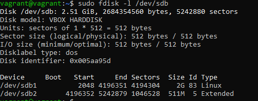

**Вопрос** №5: Используя sfdisk, перенесите данную таблицу разделов на второй диск.

**Ответ**: C помощью флага -d делаем образ системы и переносим на новый диск 

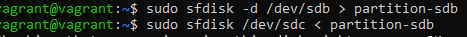

Результат: 

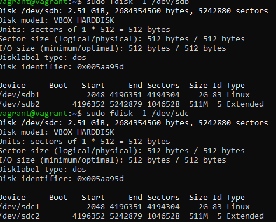

**Вопрос** №6: Соберите mdadm RAID1 на паре разделов 2 Гб.

**Ответ**: Создал RAID1 массив

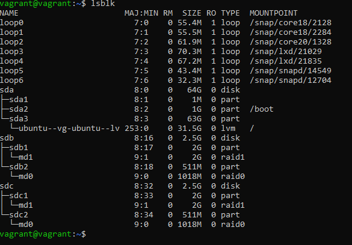

**Вопрос** №7: Соберите mdadm RAID0 на второй паре маленьких разделов.

**Ответ**: Создал RAIDO массив 

**Вопрос** №8: Создайте 2 независимых PV на получившихся md-устройствах.

**Ответ**:  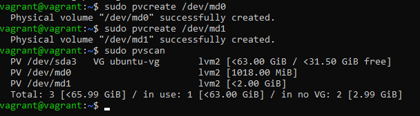

**Вопрос** №9: Создайте общую volume-group на этих двух PV.

**Ответ**: 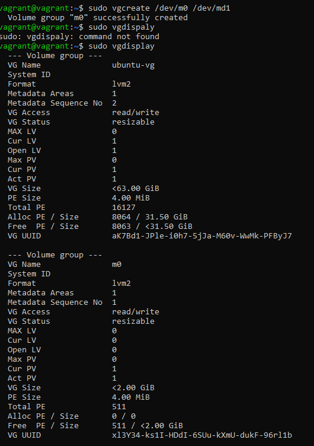

**Вопрос** №10: Создайте LV размером 100 Мб, указав его расположение на PV с RAID0.

**Ответ**: 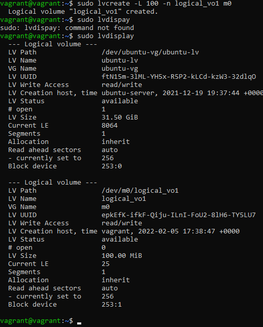

**Вопрос** №11: Создайте mkfs.ext4 ФС на получившемся LV.

**Ответ**:  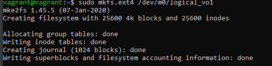

**Вопрос** №12: Смонтируйте этот раздел в любую директорию, например, /tmp/new.

**Ответ**: 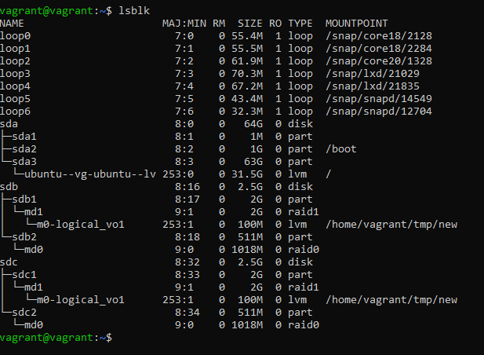

**Вопрос** №13: Поместите туда тестовый файл, например wget https://mirror.yandex.ru/ubuntu/ls-lR.gz -O /tmp/new/test.gz.

**Ответ**: 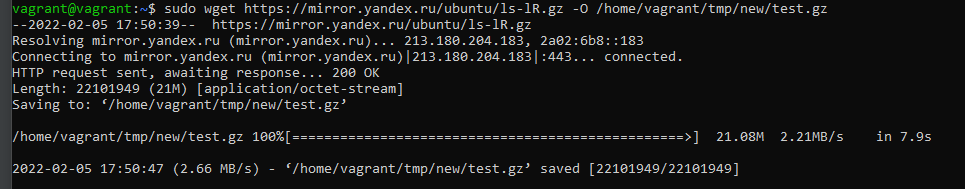

**Вопрос** №14: Прикрепите вывод lsblk.

**Ответ**: 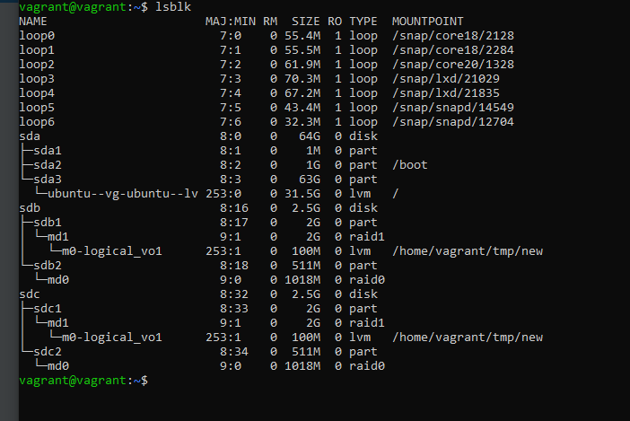

**Вопрос** №15: Протестируйте целостность файла:

root@vagrant:~# gzip -t /tmp/new/test.gz
root@vagrant:~# echo $?
0

**Ответ**: 

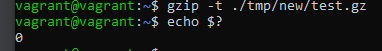

**Вопрос** №16: Используя pvmove, переместите содержимое PV с RAID0 на RAID1

**Ответ**:  

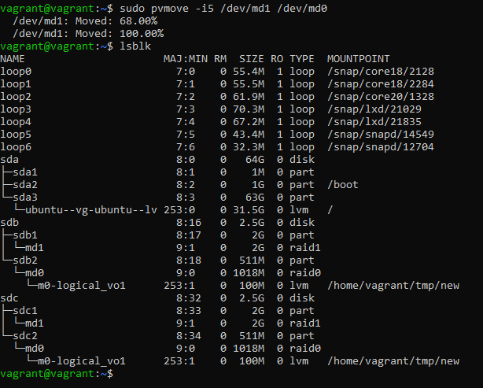

**Вопрос** №17: Сделайте --fail на устройство в вашем RAID1 md.

**Ответ**: 

**Вопрос** №18: Подтвердите выводом dmesg, что RAID1 работает в деградированном состоянии.

**Ответ**: 

**Вопрос** №19: Протестируйте целостность файла, несмотря на "сбойный" диск он должен продолжать быть доступен:

root@vagrant:~# gzip -t /tmp/new/test.gz
root@vagrant:~# echo $?
0

**Ответ**:

**Вопрос** №20: Погасите тестовый хост, vagrant destroy.

**Ответ**: 
