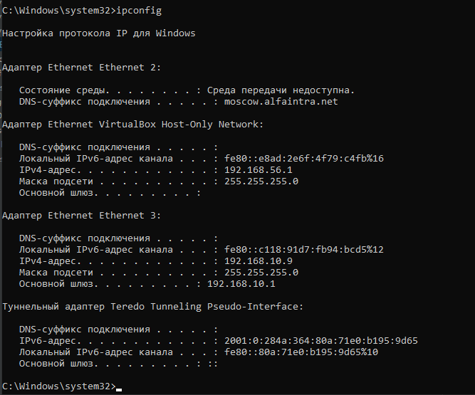

# 3.6 Компьютерные сети, лекция 1

**Вопрос** №1: Работа c HTTP через телнет.
Подключитесь утилитой телнет к сайту stackoverflow.com telnet stackoverflow.com 80
отправьте HTTP запрос
GET /questions HTTP/1.0
HOST: stackoverflow.com

В ответе укажите полученный HTTP код, что он означает?

**Ответ**: Получен ответ от сайта.

 

**Вопрос** №2: Повторите задание 1 в браузере, используя консоль разработчика F12.

откройте вкладку Network
отправьте запрос http://stackoverflow.com
найдите первый ответ HTTP сервера, откройте вкладку Headers
укажите в ответе полученный HTTP код.
проверьте время загрузки страницы, какой запрос обрабатывался дольше всего?
приложите скриншот консоли браузера в ответ.

**Ответ**:

Дольше всего обрабатывался запрос 359 мс

**Вопрос** №3: Какой IP адрес у вас в интернете?

**Ответ**: 

**Вопрос** №4: Какому провайдеру принадлежит ваш IP адрес? Какой автономной системе AS? Воспользуйтесь утилитой whois

**Ответ**:  Мой Ip пренадлежит провайдеру Билайн (Вымпелком). AS8402

**Вопрос** №5: Через какие сети проходит пакет, отправленный с вашего компьютера на адрес 8.8.8.8? Через какие AS? Воспользуйтесь утилитой traceroute

**Ответ**: Проходи множество сетей и множество AS

**Вопрос** №6: Повторите задание 5 в утилите mtr. На каком участке наибольшая задержка - delay?

**Ответ**:  наибольшая задержка бьла на AS15169  172.253.66.116 

**Вопрос** №7: Какие DNS сервера отвечают за доменное имя dns.google? Какие A записи? воспользуйтесь утилитой dig

**Ответ**: Отевчают 2 сервера. 8.8.8.8 и 8.8.4.4

**Вопрос** №8: Проверьте PTR записи для IP адресов из задания 7. Какое доменное имя привязано к IP? воспользуйтесь утилитой dig

**Ответ**: Доменное имя dns.google.

