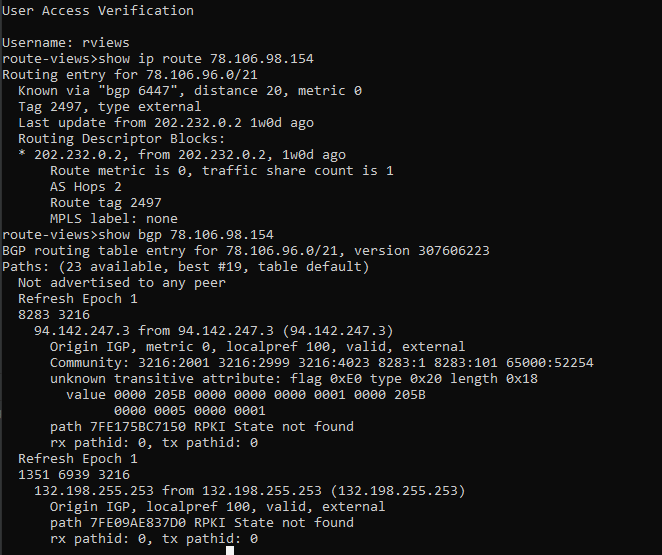
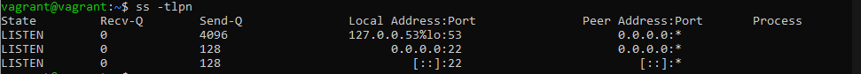
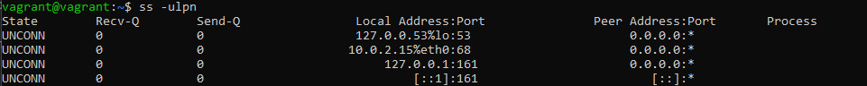
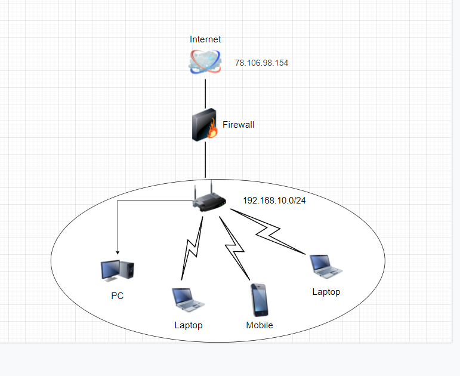

# 3.8 Компьютерные сети, лекция 3

**Вопрос** №1: Подключитесь к публичному маршрутизатору в интернет. Найдите маршрут к вашему публичному IP

* telnet route-views.routeviews.org
* Username: rviews
* show ip route x.x.x.x/32
* show bgp x.x.x.x/32
 
**Ответ**: Подключился посмотрел 

**Вопрос** №2: Создайте dummy0 интерфейс в Ubuntu. Добавьте несколько статических маршрутов. Проверьте таблицу маршрутизации.

**Ответ**:

* source-directory /etc/network/interfaces.d
* auto dummy0
* iface dummy0 inet static
* address 192.168.1.100/24
* pre-up ip link add dummy1 type dummy
* post-down ip link del dummy1

* vagrant@vagrant:~$ sudo -i
* root@vagrant:~# ip route add 172.16.10.0/24 dev eth0
* root@vagrant:~# ip route add 172.16.10.0/24 dev eth0 metric 100
* root@vagrant:~# ip -br route
* default via 10.0.2.2 dev eth0 proto dhcp src 10.0.2.15 metric 100
* 10.0.2.0/24 dev eth0 proto kernel scope link src 10.0.2.15
* 10.0.2.2 dev eth0 proto dhcp scope link src 10.0.2.15 metric 100
* 172.16.10.0/24 dev eth0 scope link
* 172.16.10.0/24 dev eth0 scope link metric 100

**Вопрос** №3: Проверьте открытые TCP порты в Ubuntu, какие протоколы и приложения используют эти порты? Приведите несколько примеров.

**Ответ**:

* Используем команду `SS -tlpn`. Видим список адресов с портами 

* 

**Вопрос** №4: Проверьте используемые UDP сокеты в Ubuntu, какие протоколы и приложения используют эти порты?

**Ответ**: 

* Используем команду `SS -ulpn`. 
* 

**Вопрос** №5: Используя diagrams.net, создайте L3 диаграмму вашей домашней сети или любой другой сети, с которой вы работали.

* 

