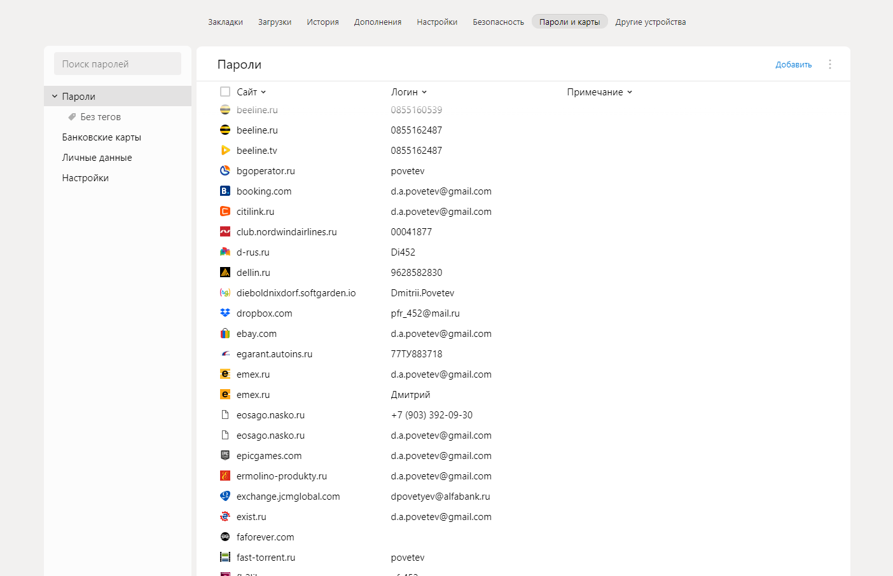
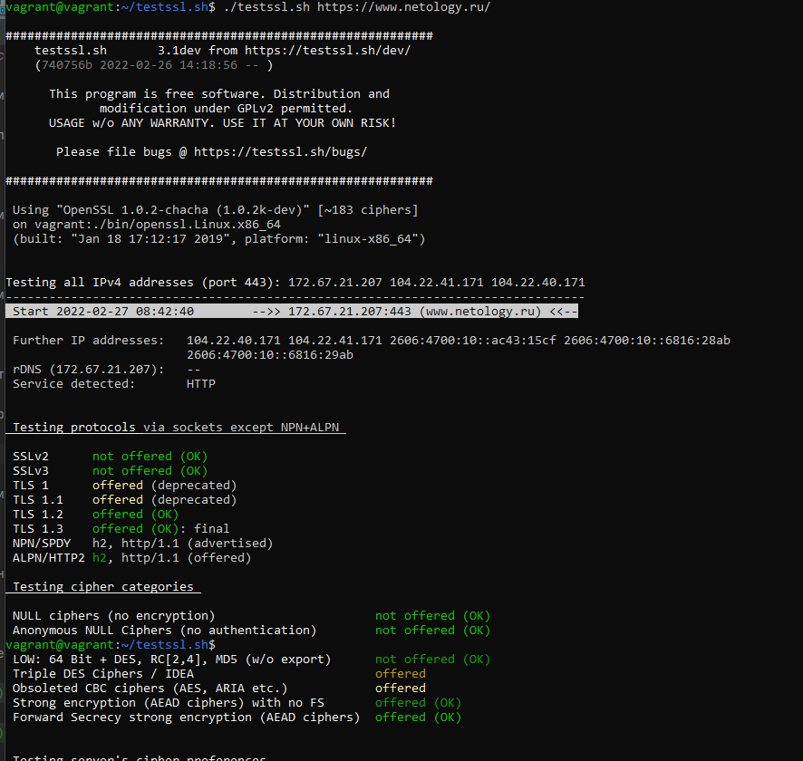
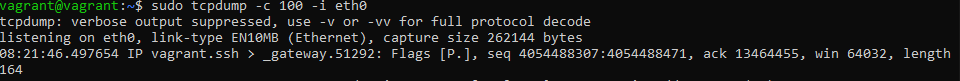
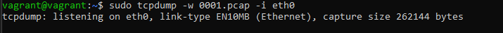

# 3.9. Элементы безопасности информационных систем

**Вопрос** №1: Установите Bitwarden плагин для браузера. Зарегестрируйтесь и сохраните несколько паролей.

**Ответ**: Пользуюсь плагином от Яндекса

**Вопрос** №2: Установите Google authenticator на мобильный телефон. Настройте вход в Bitwarden акаунт через Google authenticator OTP.

**Ответ**: Установлен, пользуюсь давно. 

**Вопрос** №3: Установите apache2, сгенерируйте самоподписанный сертификат, настройте тестовый сайт для работы по HTTPS.

**Ответ**:  Аpache2 установил, сгенерировал. Настроил. Фото приложить!!!! 

**Вопрос** №4: Проверьте на TLS уязвимости произвольный сайт в интернете (кроме сайтов МВД, ФСБ, МинОбр, НацБанк, РосКосмос, РосАтом, РосНАНО и любых госкомпаний, объектов КИИ, ВПК ... и тому подобное).

**Ответ**:  Запущена проверка на сервер www.netology.ru 

**Вопрос** №5: Установите на Ubuntu ssh сервер, сгенерируйте новый приватный ключ. Скопируйте свой публичный ключ на другой сервер. Подключитесь к серверу по SSH-ключу.

**Ответ**:  Пока не получилось, пробую, можно еще времени.

**Вопрос** №6: Переименуйте файлы ключей из задания 5. Настройте файл конфигурации SSH клиента, так чтобы вход на удаленный сервер осуществлялся по имени сервера.

**Ответ**: Пока не получилось, пробую, можно еще времени.

**Вопрос** №7: Соберите дамп трафика утилитой tcpdump в формате pcap, 100 пакетов. Откройте файл pcap в Wireshark.

Задание для самостоятельной отработки (необязательно к выполнению)

8*. Просканируйте хост scanme.nmap.org. Какие сервисы запущены?

9*. Установите и настройте фаервол ufw на web-сервер из задания 3. Откройте доступ снаружи только к портам 22,80,443