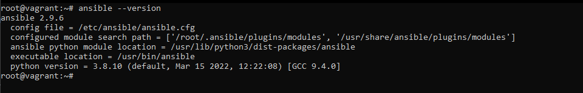

# Домашнее задание к занятию "5.2. Применение принципов IaaC в работе с виртуальными машинами"

## Задача 1

- Опишите своими словами основные преимущества применения на практике IaaC паттернов.
 
Непрерывная интреграция - Много веток с кодом сливается в одну. 
Непрерывная доставка - Написанный код, тестируется, перемещается в репозиторий и от туда можно сразу запустить его на тестовом стенде. 
Непрерывное развертывание - Автоматизирует процесс передачи изменений с репозитория на тестовые стенды, без участия человека.

- Какой из принципов IaaC является основополагающим?

Идемпоте́нтность - это метод когда на выходе получаем тот же результат снова и снова.


## Задача 2

- Чем Ansible выгодно отличается от других систем управление конфигурациями?

Не требует установки KPI. Работает на существующей инфраструктуре SSH. 

- Какой, на ваш взгляд, метод работы систем конфигурации более надёжный push или pull?

Для малой сети лучше использовать метод `Push`, для большой сети лучше `Pull` т.к. меньше нагрузка на управляющей сервер.

## Задача 3

Установить на личный компьютер:

- VirtualBox


- Vagrant


- Ansible



*Приложить вывод команд установленных версий каждой из программ, оформленный в markdown.*


## Задача 4 (*)

Воспроизвести практическую часть лекции самостоятельно.

- Создать виртуальную машину.
- Зайти внутрь ВМ, убедиться, что Docker установлен с помощью команды
```
docker ps
```